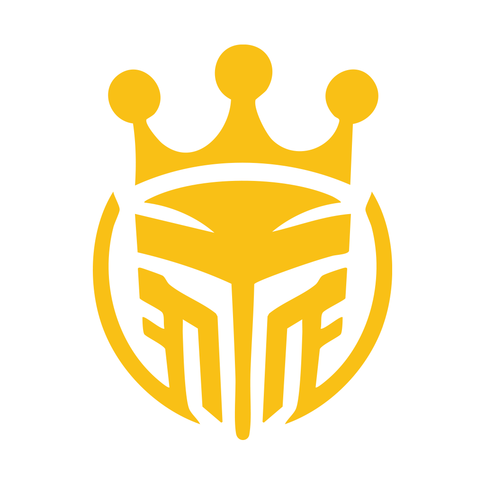

<div align="center">



# EsportsHall

[](https://nextjs.org/)
[](https://supabase.com/)
[](https://tailwindcss.com/)
[](https://bun.sh/)
[](https://vercel.com/)

**La plataforma definitiva para la comunidad española de esports**

</div>

---

## 📋 Tabla de Contenidos

- [👾 Visión General](#-visión-general)
- [🚀 Características](#-características)
- [💡 Stack Tecnológico](#-stack-tecnológico)
- [🛠️ Instalación](#️-instalación)
- [⚙️ Configuración](#️-configuración)
- [🤝 Contribuir](#-contribuir)
- [📝 Licencia](#-licencia)

---

## 👾 Visión General
EsportsHall es una plataforma integral para la comunidad española de esports, ofreciendo:
- Foros especializados por juego (LoL, Valorant, CS2)
- Seguimiento en tiempo real de partidas y torneos
- Perfiles personalizados de jugadores
- Integración con Twitch y bolsa de trabajo
- Chat comunitario 24/7

## 🚀 Características

| Característica | Descripción |
|---------------|-------------|
| 💬 Foros | Discusiones categorizadas, hilos en tiempo real, sistema de votaciones |
| 📊 Competitividad | Resultados en vivo, estadísticas detalladas, calendario de eventos |
| 👥 Perfiles | Historial de logros, equipos anteriores, configuración de privacidad |
| 📡 Integraciones | Streams embeds de Twitch, sistema de aplicaciones para equipos profesionales |
| 🛠️ Soporte | Chat técnico en tiempo real usando Supabase Realtime |

### 💡 Stack Tecnológico

<div align="center">

[](https://skillicons.dev)
[](https://skillicons.dev)

</div>

### Tecnologías

**Frontend**
- Next.js 15 + React 19 (SSR/ISR)
- Tailwind CSS 3 (Diseño responsive)
- Supabase Auth (Autenticación social)
- Vercel (Deployment y hosting)

**Backend & Infraestructura**
- Bun Runtime (v1.2.2)
- Hono Framework (APIs RESTful)
- Supabase (BaaS - Base de datos y Auth)
- Cloudflare Workers (Edge functions)

## 🛠️ Instalación

<details>
<summary>📦 Prerrequisitos</summary>

- Node.js 18+
- Bun 1.0+
- Cuenta en Supabase

</details>

<details>
<summary>💻 Pasos de Instalación</summary>

```bash
# Clonar repositorio
git clone https://github.com/tu-usuario/esportshall.git

# Frontend
cd frontend
bun install
bun run dev

# Backend 
cd ../backend
bun install
bun start
```

</details>

## ⚙️ Configuración

<details>
<summary>🔐 Variables de Entorno</summary>

```ini
NEXT_PUBLIC_SUPABASE_URL="TU_URL_SUPABASE"
NEXT_PUBLIC_SUPABASE_ANON_KEY="TU_KEY_SUPABASE"
```

</details>

## 🤝 Contribuir

<div align="center">

[](http://makeapullrequest.com)

</div>

¿Eres parte de la comunidad española de esports? ¡Tu ayuda es bienvenida!

1. Haz fork del proyecto
2. Crea tu rama (`git checkout -b feature/nueva-funcionalidad`)
3. Commit cambios (`git commit -m 'Add amazing feature'`)
4. Push a la rama (`git push origin feature/nueva-funcionalidad`)
5. Abre un Pull Request

## 📝 Licencia

MIT License